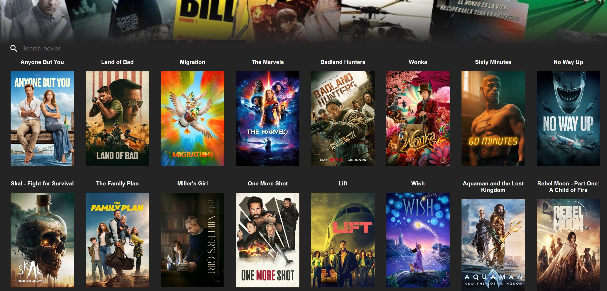
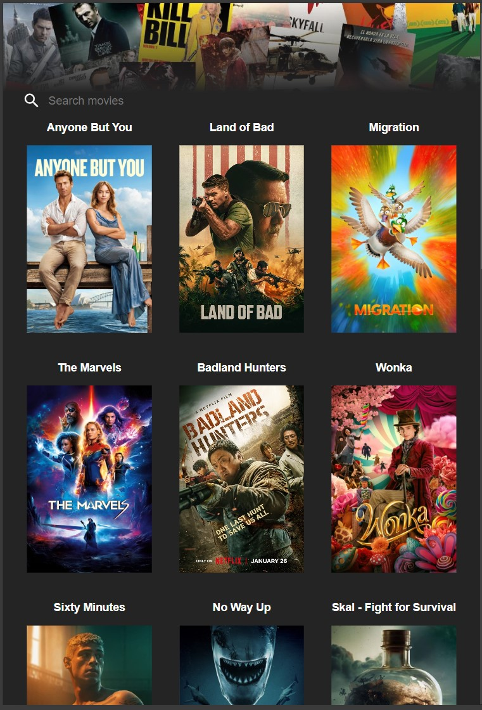
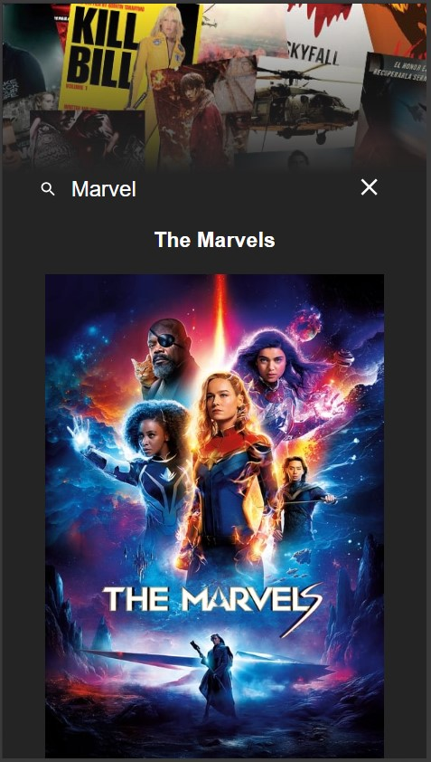
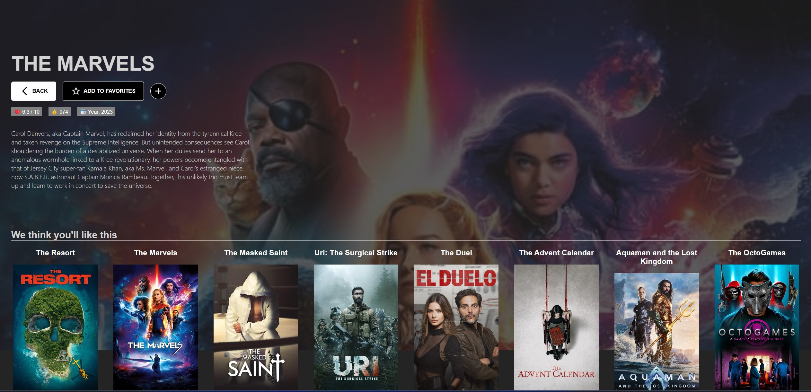
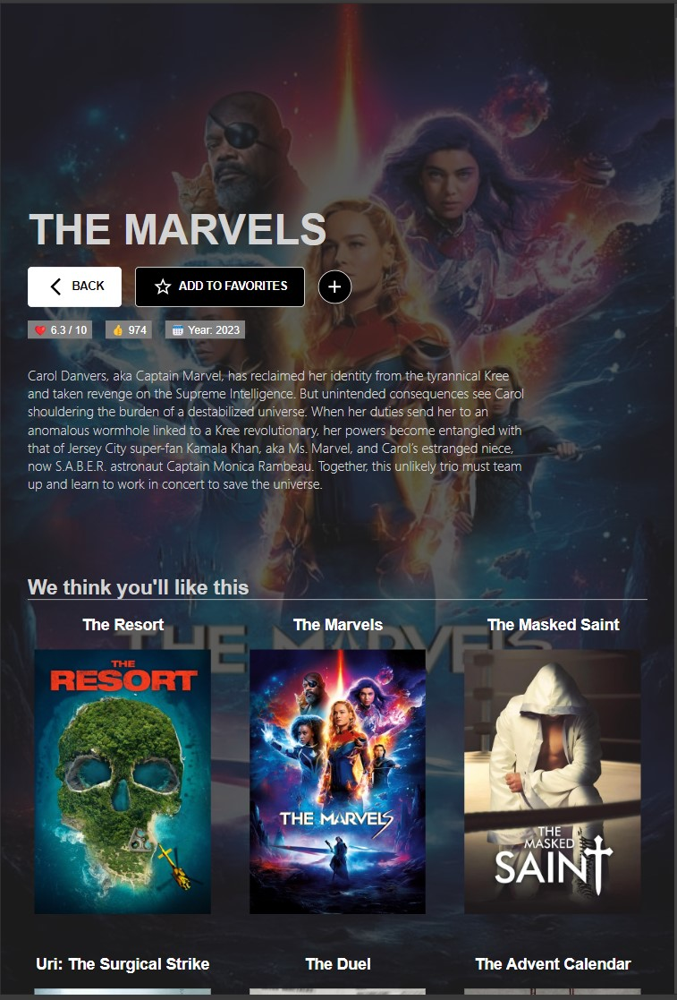
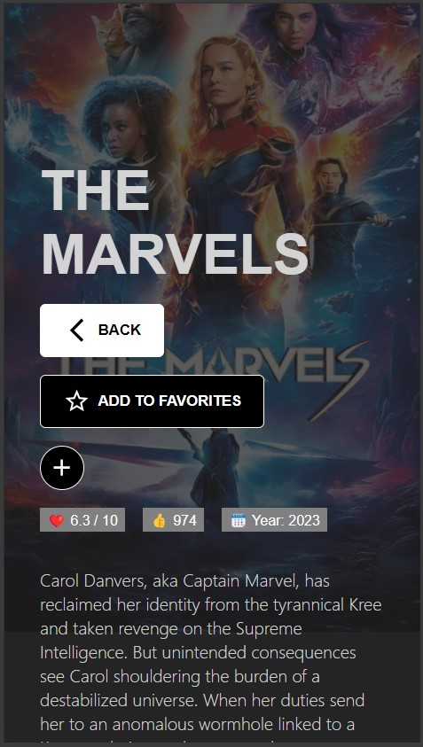
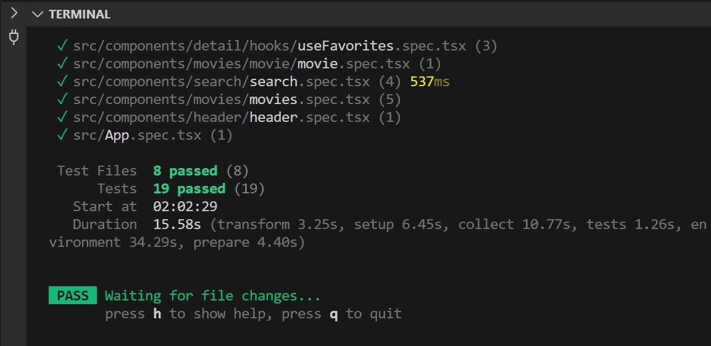
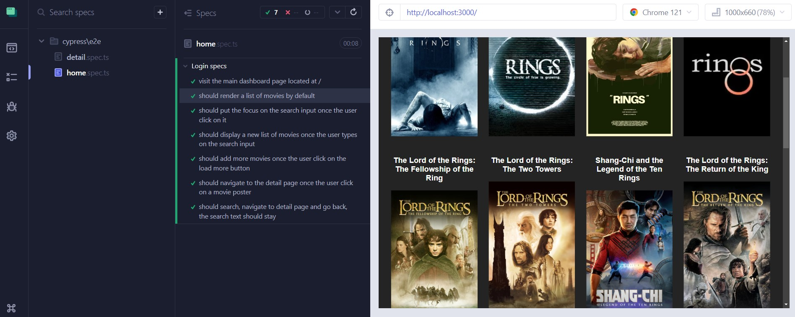
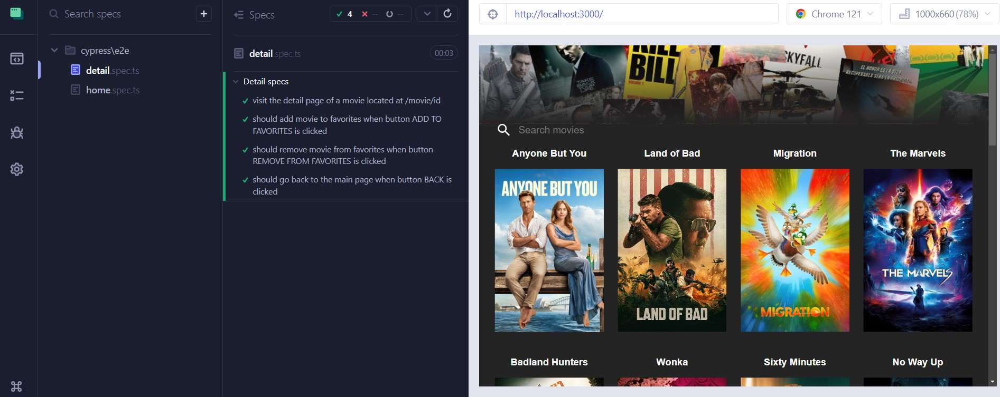

## Public Link --> [HERE](https://celadon-clafoutis-d51e6d.netlify.app/)
## Screenshots below ⬇️

Technology used:
- SPA with React and TypeScript.
- Vite for Setup.
- Sass Modules for styling.
- React Router for navigation.
- Tanstack React Query for server state.
- React Context.
- Vitest & React Testing Library for Unit Testing.
- Cypress for E2E Testing.

## Before
```js
git clone https://github.com/pGarciaAndres/react-2024.git
cd '.\React 2024\videoclub-app\'
npm install
```
## How to RUN 
```js
npm run dev
```
## How to TEST 
```js
npm run test
```
## How to CYPRESS 
```js
npm run test:e2e
```

## Home



## Detail



## Unit Test

## Cypress Test


